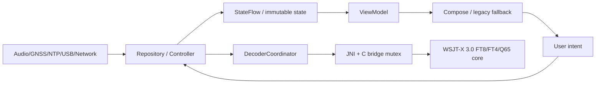

# FT8CN 架构说明

## 数据流

页面不直接操作 JNI、系统时钟、USB socket 或网络。高频音频、DSP 和 CAT 更新在专用 dispatcher/lane 执行；主线程只接收有界摘要和 UI state。PCM、waterfall 大数组与 native 指针不得进入 Compose state。

## 核心接口

- `DisciplinedClock`：以 Android monotonic clock 为锚，提供 UTC、offset、drift、uncertainty、source、age 和 health。
- `DecoderCoordinator`：在请求创建时快照 live/disk、采样率、QSO/TX 频率、模式、stage、pass/round 和灵敏度；处理期间不读取变化的 UI 全局值。
- `RadioController`：统一频率、模式、VFO、split、PTT、功率、读回、事务、错误和连接状态。
- `DopplerEngine`：只计算带时间戳与 uncertainty 的 EME/卫星目标频率，不直接操作电台。
- `QsoLogRepository`：Room 中的 QSO、ADIF 与 LoTW 审计状态。
- `AutomationController`：armed 的显式有限状态机；同一 slot 最多一个动作，支持 stop、限次、退避和 watchdog。

## Native 串行边界

FT8 仅在单个请求内部并行 `sync8` 的独立频率行，并限制为最多两个性能线程。候选归并、`ft8b`、LDPC/OSD、subtract 和 callback 串行。FT4 的 OpenMP 实验已因真机变慢而移除；Q65、Java `nativeBatchDecodeLock`、C bridge mutex 和 Q65 serial lane 保持串行。`PARALLEL_NATIVE` 默认禁用。

## 长周期内存

FT8/FT4 仍使用官方核心所需的完整 slot。Q65 24/48 kHz 生产录音按 4096-sample chunk 直接抽取到最终 12 kHz frame，不保留完整高采样率源数组；TX 由连续相位 native chunk 和 `AudioTrack.MODE_STREAM` 组成，不持有完整 Java 波形。

## 页面边界

- Call：仅 FT8/FT4。
- EME：Q65A-E、averaging 与 EME Doppler；F 仅诊断。
- Satellite：离线缓存、SGP4、pass 与双向 Doppler。
- Logbook/LoTW：Room、ADIF 与已签名 TQ8。
- Radio：rigctld/既有 transport、split/Fake It 与 PTT 安全。
- Settings/Time：DataStore、NTP/GNSS health 与解码策略。

现代 Compose shell 与完整 legacy fallback 目前并存；在 Compose 功能和真机交互门禁全部完成前，不删除成熟操作路径。
